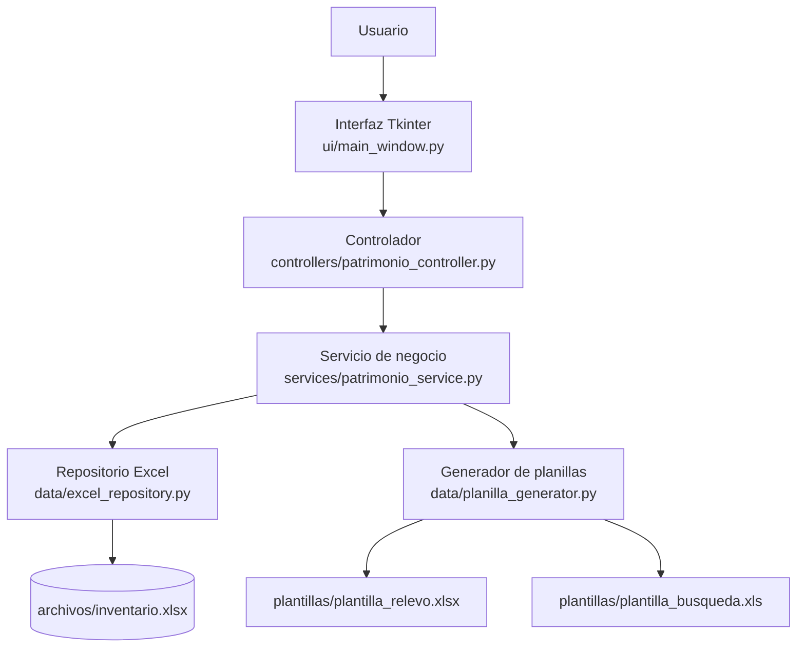
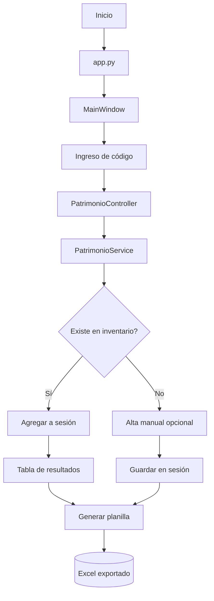
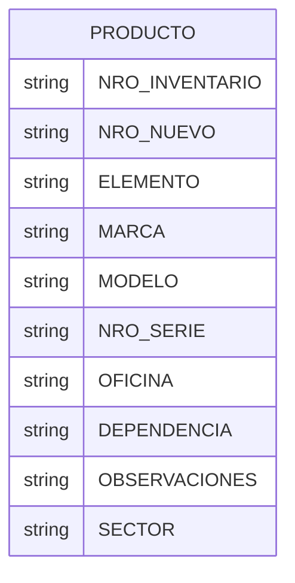

# Relevo Patrimonio

Aplicación de escritorio desarrollada en Python para controlar bienes patrimoniales mediante escaneo de códigos, carga de información en sesión y generación de planillas Excel para relevamiento y búsqueda masiva.

La herramienta está orientada a procesos de inventario físico o relevamiento de activos, donde el usuario escanea un código y valida si el bien existe en el archivo maestro del patrimonio. Cuando no hay coincidencia, puede registrarlo manualmente dentro de la sesión activa; luego puede generar reportes conforme a distintas plantillas de Excel.

---

## 1. Descripción general

### Nombre de la aplicación

La aplicación se presenta como `Relevo Patrimonio` y, dentro de la interfaz, como `Control de Patrimonio`.

### Qué problema resuelve

Resuelve la necesidad de registrar y verificar bienes patrimoniales a partir de códigos de inventario y/o serie, organizarlos por sector y generar archivos Excel con los resultados de la sesión de relevamiento.

### Para qué fue desarrollada

Fue desarrollada para apoyar tareas de relevamiento patrimonial, inventario físico y control de bienes en distintos sectores o dependencias, con flujo de escaneo y exportación de reportes.

### Quién podría utilizarla

La aplicación está pensada para personal de patrimonio, inventario, administración, áreas operativas o cualquier usuario que necesite registrar bienes de un sector y producir planillas de control.

### Objetivo principal

Centralizar el flujo de escaneo de bienes, validar coincidencias con un inventario base, mantener una sesión activa de productos y producir archivos exportables para uso operativo.

### Tareas que permite realizar

- Escaneo de códigos de bienes.
- Búsqueda de coincidencias en un inventario cargado desde Excel.
- Registro manual de productos no encontrados.
- Organización por sector.
- Modificación de observaciones.
- Eliminación de registros de la sesión actual.
- Generación de planillas de relevo.
- Generación de planillas de búsqueda masiva.
- Visualización de resultados en tabla desde la interfaz gráfica.

---

## 2. Características principales

Las funcionalidades identificadas en el código son las siguientes:

- Escaneo de artículos por código.
- Búsqueda por coincidencia en múltiples identificadores: `NRO_INVENTARIO`, `NRO_NUEVO`, `NRO_SERIE`.
- Detección de códigos duplicados dentro de la sesión actual.
- Alta manual de productos no existentes en el inventario base.
- Gestión de sesión activa.
- Asignación de sector por usuario.
- Coloración visual por sector en la tabla principal.
- Edición de observaciones por registro.
- Eliminación de registros seleccionados.
- Generación de planilla Excel de relevamiento.
- Generación de planilla Excel de búsqueda masiva.
- Persistencia de inventario maestra en Excel.
- Lectura del archivo Excel principal con `pandas`.
- Interfaz gráfica con Tkinter mediante `ttkbootstrap`.
- Soporte de tema claro y oscuro.
- Exportación de resultados a archivos `.xlsx` y `.xls`.

> No se detectan módulos de autenticación, usuarios, roles, permisos, exportación PDF ni base de datos relacional en el proyecto.

---

## 3. Tecnologías utilizadas

### Lenguaje

- Python.
- El entorno del proyecto configurado en el workspace usa Python 3.14.2.
- El código hace uso de tipado moderno (`list[Producto]`, `Producto | None`), compatible con versiones actuales de Python.

### Frameworks y librerías

| Dependencia | Uso identificado |
| --- | --- |
| `ttkbootstrap` | Interfaz gráfica de escritorio moderna y temas visuales para Tkinter. |
| `pandas` | Lectura y escritura de archivos Excel, manipulación de DataFrame. |
| `openpyxl` | Lectura/escritura de archivos `.xlsx` para plantillas de relevamiento. |
| `xlrd` | Lectura de archivos Excel `.xls` de plantilla de búsqueda. |
| `xlutils` | Copia y modificación de libros `.xls` para la planilla de búsqueda masiva. |
| `xlwt` | Soporte de generación de archivos `.xls` en la lógica de plantillas. |
| `PyInstaller` | Empaquetado del proyecto como ejecutable `.exe` mediante `Relevo_Patrimonio.spec`. |
| `Pillow` | Presente en dependencias; no se observa uso directo en el código fuente. |
| `darkdetect` | Dependencia presente; no se observa uso directo explícito en el código fuente. |
| `numpy` | Dependencia de `pandas` y ecosistema de Excel; no se usa directamente en la lógica principal. |

### Base de datos

No se detecta una base de datos relacional ni un motor SQL. El proyecto utiliza archivos Excel como almacenamiento principal.

- Motor: No identificado (no hay SQLite, PostgreSQL, MySQL ni archivos `.db`/`.sqlite` en la estructura).
- Forma de acceso: lectura/escritura mediante `pandas` y bibliotecas de Excel.
- Estructura general: un archivo maestro `archivos/inventario.xlsx` se usa como fuente de datos de inventario.
- ORM/SQL: No aplica. No se observa SQL ni ORM.

### Interfaz

- Biblioteca principal: `Tkinter` con `ttkbootstrap`.
- Estilo: ventanas emergentes, Treeview, botones, formularios y diálogos modaless/modales.
- Tiene soporte para modo claro y oscuro.

### Herramientas

- `PyInstaller` para generar ejecutables.
- `Excel` como fuente y salida de datos.
- `ttkbootstrap` para UI y estilo visual.
- `pandas`/`openpyxl`/`xlrd/xlutils` para manejo de hojas de cálculo.

---

## 4. Arquitectura de la aplicación

La aplicación presenta una arquitectura modular por capas con una fuerte influencia de MVC, aunque no es una implementación web ni un framework MVC formal. La separación real observada es la siguiente:



### Capa de presentación

- `ui/main_window.py`: ventana principal, Treeview, botones, eventos de escaneo, generación de reportes, cambio de tema.
- `ui/dialogs.py`: formulario para alta manual de producto.
- `ui/planillas_dialogs.py`: formulario para completar datos de relevamiento.
- `ui/observacion_dialogs.py`: ventana para editar observaciones.

### Lógica de negocio

- `services/patrimonio_service.py`: validación de códigos, búsqueda de productos, manejo de sesión escaneada, sector actual, generación de reportes y organización visual por color.

### Acceso a datos

- `data/excel_repository.py`: carga y exportación usando `pandas`.
- `data/planilla_generator.py`: toma la plantilla base y la rellena con datos de la sesión.

### Persistencia

- El inventario base se encuentra en `archivos/inventario.xlsx`.
- Las planillas exportadas se generan en archivos `.xlsx` o `.xls` según la opción.
- No se observa persistencia en base de datos ni serialización de estado.

### Servicios/utilidades

- `obtener_ruta_recurso(...)`: resuelve rutas reales para ejecutables generados con PyInstaller y para entorno de desarrollo.
- `PlanillaGenerator`: centraliza la lógica de llenado de plantillas en Excel.

### Controladores

- `controllers/patrimonio_controller.py`: conecta la capa de interfaz con la capa de servicios.

### Modelos

- `models/producto.py`: define el modelo `Producto` con identificadores y atributos del bien.

> La estructura del proyecto indica una separación funcional clara, pero la app es una solución monolítica de escritorio, no un sistema distribuido ni una aplicación web.

---

## 5. Estructura del proyecto

```text
Relevo_Patrimonio/
├── app.py
├── requirements.txt
├── Relevo_Patrimonio.spec
├── .gitignore
├── archivos/
│   └── inventario.xlsx
├── assets/
│   └── icono.ico
├── build/
│   └── Relevo_Patrimonio/
├── controllers/
│   ├── __init__.py
│   └── patrimonio_controller.py
├── data/
│   ├── __init__.py
│   ├── excel_repository.py
│   └── planilla_generator.py
├── dist/
├── models/
│   ├── __init__.py
│   └── producto.py
├── plantillas/
│   ├── plantilla_busqueda.xls
│   └── plantilla_relevo.xlsx
├── services/
│   ├── __init__.py
│   └── patrimonio_service.py
├── ui/
│   ├── __init__.py
│   ├── dialogs.py
│   ├── main_window.py
│   ├── observacion_dialogs.py
│   └── planillas_dialogs.py
└── .venv/
```

### Responsabilidad de cada carpeta y archivo importante

- `app.py`: punto de entrada de la aplicación; inicializa controlador y ventana principal.
- `controllers/patrimonio_controller.py`: orquesta las acciones entre UI y servicio.
- `services/patrimonio_service.py`: lógica principal del negocio: búsqueda, duplicados, sesión, colores, exportación y generación.
- `models/producto.py`: modelo de datos del producto/patrimonio.
- `data/excel_repository.py`: acceso a Excel como repositorio de inventario y exportación de escaneos.
- `data/planilla_generator.py`: rellena plantillas predefinidas con los datos del relevamiento y la búsqueda masiva.
- `ui/main_window.py`: interfaz principal del sistema.
- `ui/dialogs.py`: alta manual de producto no hallado.
- `ui/planillas_dialogs.py`: formulario de metadatos de la planilla de relevo.
- `ui/observacion_dialogs.py`: edición de observaciones del producto seleccionado.
- `archivos/inventario.xlsx`: archivo maestro que contiene el inventario base leido por la app.
- `plantillas/plantilla_relevo.xlsx`: plantilla base para relevamiento patrimonial.
- `plantillas/plantilla_busqueda.xls`: plantilla base para busqueda masiva.
- `assets/icono.ico`: icono del ejecutable.
- `Relevo_Patrimonio.spec`: configuración de PyInstaller.

> Se excluyen de esta documentación carpetas generadas automáticamente como `build/`, `dist/` y `__pycache__` porque no forman parte de la lógica funcional original del proyecto.

---

## 6. Funcionamiento de la aplicación

### 1. Inicio

Al ejecutar `python app.py`, el programa crea una instancia de `PatrimonioController`, que a su vez crea `PatrimonioService`.

### 2. Inicialización

Durante la construcción del servicio:

- se carga `ExcelRepository`
- se lee la base de inventario desde `archivos/inventario.xlsx`
- se inicializa una lista `escaneados_sesion`
- se inicializa `sector_actual`
- se preparan paletas de color para diferenciar sectores visualmente

### 3. Carga de configuración

No se observa un archivo `.env`, `.ini`, ni configuración externa. La aplicación resuelve rutas según si corre en desarrollo o como ejecutable empaquetado por PyInstaller.

### 4. Conexión con la base de datos

No hay conexión a base de datos; la fuente de verdad del inventario es un archivo Excel. La lectura se hace con `pandas.read_excel()`.

### 5. Inicio de la interfaz

`MainWindow` genera una ventana principal con:

- campo de escaneo
- botón de procesar
- selector de sector
- tabla de bienes escaneados
- botones para editar, eliminar y exportar planillas
- alternador de tema claro/oscuro

### 6. Flujo de operaciones

1. El usuario ingresa un código en la ventana principal.
2. La aplicación limpia el campo y llama al controlador.
3. El controlador delega al servicio.
4. El servicio compara el código con los productos de `inventario_general`.
5. Si existe coincidencia, se agrega a la sesión actual.
6. Si el código ya fue registrado en la sesión, se informa como duplicado.
7. Si no existe, se consulta si se desea dar de alta manualmente.
8. Si se acepta, abre un diálogo para completar datos del bien.
9. El bien se agrega a la lista de sesión actual y se muestra en la tabla.

### 7. Procesamiento de información

- La lógica de búsqueda toma el código y compara con `nro_nuevo`, `nro_inventario` y `nro_serie`.
- El producto se almacena en una lista de sesión activa.
- Cada producto puede tener `observaciones` y `sector` asociados.
- Los registros visuales se muestran en un `Treeview` con color por sector.

### 8. Persistencia

Se persiste de dos formas:

- inventario base: `archivos/inventario.xlsx`
- exportación de resultados: archivos Excel generados por el usuario.

### 9. Generación de resultados

El usuario puede exportar:

- planilla de relevamiento
- planilla de búsqueda masiva

Ambos resultados se escriben como archivos Excel según la plantilla correspondiente.



---

## 7. Flujo de las funcionalidades principales

### 7.1 Escaneo y validación

- Se dispara desde la ventana principal al presionar Enter o el botón Procesar.
- Recibe un `codigo` ingresado por el usuario.
- El servicio realiza una búsqueda iterativa dentro de `inventario_general`.
- Compara con tres campos:
  - `nro_inventario`
  - `nro_nuevo`
  - `nro_serie`
- Si coincide, devuelve un producto encontrado.
- Si ya apareció en la sesión actual, devuelve `razon = "duplicado"`.
- Si no coincide, la aplicación consulta si se desea dar de alta manual.

### 7.2 Alta manual de producto

- Se activa cuando el código no existe.
- Abre el diálogo `AgregarProductoDialog`.
- El usuario completa datos del bien.
- Se valida que `elemento` no esté vacío.
- Se crea una instancia de `Producto` con los campos ingresados.
- El registro se agrega a `escaneados_sesion` del servicio.
- El producto no se guarda en el Excel maestro según el código actual, salvo que se llame explícitamente a `guardar_nuevo_producto` en otra parte del sistema (lo cual no ocurre en este flujo).

### 7.3 Generación de planilla de relevamiento

- Se dispara al presionar `Planilla de Relevo`.
- Se abre `PlanillaRelevoDialog` para completar piso, oficina, área, dependencia, responsable, subresponsable y teléfono.
- El servicio llama a `PlanillaGenerator.generar_relevo(...)`.
- La plantilla base `plantilla_relevo.xlsx` se carga con `openpyxl`.
- Los productos de la sesión se vuelcan en columnas correspondientes.
- Se guarda en una ruta elegida por el usuario.

### 7.4 Generación de planilla de búsqueda masiva

- Se dispara desde la ventana principal.
- El sistema toma los resultados actuales de la sesión.
- El usuario elige la ruta y nombre del archivo.
- El generador usa `xlrd` + `xlutils.copy` para generar un `.xls` con los datos repetidos en columnas A y B.

### 7.5 Edición de observaciones y eliminación

- El doble clic sobre una fila abre `EditarObservacionDialog`.
- Se modifica el atributo `observaciones` del objeto producto.
- La eliminación se realiza desde la tabla seleccionada y luego se recalcula la numeración.

---

## 8. Base de datos

### Estado real del proyecto

No existe una base de datos relacional ni archivos SQL. La capa de persistencia real es Excel.

### Archivo maestro

- Ruta: `archivos/inventario.xlsx`
- Contenido: listado de bienes patrimoniales leídos por `ExcelRepository.obtener_inventario()`.
- Estructura esperada según el código:
  - `NRO_INVENTARIO`
  - `NRO_NUEVO`
  - `ELEMENTO`
  - `MARCA`
  - `MODELO`
  - `NRO_SERIE`
  - `OFICINA`
  - `DEPENDENCIA`
  - `OBSERVACIONES`
  - `SECTOR`

### Relaciones

No hay relaciones entre tablas ni claves primarias/foráneas definidas. El modelo de datos es un conjunto de filas dentro de un mismo listado Excel.



### Cómo se inicializa

La aplicación no crea una base ni corre migraciones. Simplemente intenta leer el Excel del inventario; si no existe, imprime una advertencia y devuelve una lista vacía.

---

## 9. Patrones y metodología de desarrollo

Los patrones que se pueden identificar con evidencia son:

- Separación por capas: UI, controlador, servicio y acceso a datos.
- Arquitectura modular por responsabilidades.
- Modelo de dominio: `Producto`.
- Service layer: `PatrimonioService` centraliza la lógica del negocio.
- Repositorio de datos: `ExcelRepository` encapsula el acceso a Excel.
- Programación orientada a objetos: clases para `Producto`, `MainWindow`, `PatrimonioController`, `PatrimonioService` y dialogos.
- Manejo de excepciones y validaciones en formularios y guardado de archivos.

Se detecta una estructura claramente organizada, pero no un framework de backend ni patrones avanzados de inyección de dependencias formales.

---

## 10. Programación orientada a objetos

Sí existe POO en el proyecto, con varios elementos relevantes:

### Clases principales

- `Producto`: representa cada bienes.
- `PatrimonioService`: lógica de negocio y gestión de sesión.
- `PatrimonioController`: adaptador entre UI y servicio.
- `MainWindow`: ventana principal de la aplicación.
- `AgregarProductoDialog`: alta manual de producto.
- `PlanillaRelevoDialog`: configuración del relevamiento.
- `EditarObservacionDialog`: edición de observaciones.
- `ExcelRepository`: acceso al inventario y exportación.
- `PlanillaGenerator`: generación de hojas de cálculo.

### Responsabilidades

- `Producto`: encapsula atributos del bien y convierte a diccionario para Excel.
- `PatrimonioService`: valida escaneos, duplica detectado y exporta planillas.
- `PatrimonioController`: expone acciones orientadas a la UI.
- `MainWindow`: orquesta la interacción del usuario con la lógica del sistema.

### Encapsulamiento

Los objetos contienen propiedades como `nro_inventario`, `nro_nuevo`, `elemento`, `sector`, etc. Se usa una clase para modelar la entidad de negocio.

### Herencia

Se observa uso de herencia de clases Tkinter/
`ttkbootstrap`:

- `MainWindow(tb.Window)`
- `AgregarProductoDialog(tb.Toplevel)`
- `PlanillaRelevoDialog(tb.Toplevel)`
- `EditarObservacionDialog(tb.Toplevel)`

### Composición

`PatrimonioService` compone:

- `ExcelRepository`
- `PlanillaGenerator`
- `lista de productos` para la sesión actual

---

## 11. Manejo de errores y validaciones

La aplicación implementa validaciones y manejo de errores en varios puntos:

- Validación de código vacío: si el campo de escaneo está vacío, no se procesa nada.
- Validación de producto manual: `elemento` es obligatorio.
- Detección de duplicados: se advierte si el bien ya fue escaneado en la sesión.
- Verificación de existencia: si el código no coincide con el inventario, se ofrece alta manual.
- Manejo de errores de archivo: `ExcelRepository.guardar_nuevo_producto` recoge `PermissionError` y muestra un mensaje si el archivo está bloqueado por Excel.
- Manejo de errores inesperados: se muestran mensajes con `messagebox.showerror`.
- Validación de planillas: si no hay elementos en la sesión, se muestra una advertencia antes de generar la planilla.
- Verificación de rutas: `obtener_ruta_recurso` intenta resolver archivos en modo desarrollo y empaquetado.

No se observan mecanismos explícitos de logging estructurado ni trazas avanzadas, aunque el código imprime errores por consola en `PlanillaGenerator` cuando falla la exportación.

---

## 12. Seguridad

La aplicación no incorpora mecanismos de seguridad avanzados ni autenticación.

Se detectan únicamente estas condiciones:

- validación básica de datos en formularios
- verificación de campos obligatorios
- control de sesión local en memoria
- manejo de mensajes para errores de usuario

No se detectan:

- autenticación
- autorización
- gestión de sesiones persistentes
- cifrado de datos sensibles
- variables de entorno para secretos
- hash de contraseñas
- control de acceso por roles

> La aplicación no maneja credenciales ni almacena información sensible con protección específica.

---

## 13. Instalación

### Requisitos previos

- Python 3.10+ (el proyecto se ejecuta correctamente en un entorno con Python 3.14.2 en el workspace actual).
- `pip`
- Entorno virtual recomendado.

### Clonar o descargar el proyecto

```bash
git clone <url-del-repositorio>
cd Relevo_Patrimonio
```

### Crear entorno virtual

#### Windows

```powershell
python -m venv .venv
.\.venv\Scripts\Activate.ps1
```

#### Linux/macOS

```bash
python -m venv .venv
source .venv/bin/activate
```

### Instalar dependencias

```bash
pip install -r requirements.txt
```

---

## 14. Ejecución

La ejecución principal del proyecto es:

```bash
python app.py
```

También puede ejecutarse el archivo empaquetado generado por PyInstaller a partir de `Relevo_Patrimonio.spec`, si ya se ha construido el ejecutable.

---

## 15. Configuración

### Archivos de configuración

No se observa archivo `.env`, `.ini`, `settings.json`, ni configuración central externa.

### Rutas relevantes

- inventario: `archivos/inventario.xlsx`
- plantillas: `plantillas/plantilla_relevo.xlsx` y `plantillas/plantilla_busqueda.xls`
- icono: `assets/icono.ico`

### Consideraciones

La aplicación resuelve rutas dinámicamente para soportar:

- entorno de desarrollo local
- ejecutable generado con PyInstaller

Esto se implementa con `obtener_ruta_recurso()` en `data/excel_repository.py` y `data/planilla_generator.py`.

---

## 16. Uso de la aplicación

1. Ejecutar la aplicación usando `python app.py`.
2. Ingresar el código del bien en el campo `Código Escaneado`.
3. Presionar Enter o `Procesar`.
4. Si el código existe, la fila se agrega a la sesión actual.
5. Si el código no existe, confirmar alta manual.
6. Completar los datos del producto y guardar.
7. Definir un sector con `📍 Definir Sector`.
8. Revisar la tabla de bienes escaneados.
9. Modificar observaciones o eliminar registros según corresponda.
10. Generar la planilla de relevo o la de búsqueda masiva.

---

## 17. Ejemplo de flujo completo

Un caso típico de uso:

1. El usuario abre la app.
2. Define el sector actual: `Administración`.
3. Escanea el código `12345`.
4. El sistema busca ese término en `NRO_INVENTARIO`, `NRO_NUEVO` y `NRO_SERIE`.
5. El bien existe en el inventario base.
6. Se agrega a la tabla con el sector `ADMINISTRACION` y color asociado.
7. Se incorpora una observación si corresponde.
8. El usuario escanea más bienes del mismo sector.
9. Cuando termina, genera la `Planilla de Relevo`.
10. Completa piso, oficina, área, responsable y subresponsable.
11. Elige la ruta del archivo.
12. El sistema rellena la plantilla Excel y guarda el reporte.

---

## 18. Generación de archivos / reportes

### Planilla de relevo

- Archivo base: `plantillas/plantilla_relevo.xlsx`
- Formato: `.xlsx`
- Se genera al completar metadatos del relevamiento.
- Contiene: fecha, piso, oficina, área, dependencia, responsable, subresponsable, teléfono y bienes de la sesión.

### Planilla de búsqueda masiva

- Archivo base: `plantillas/plantilla_busqueda.xls`
- Formato: `.xls`
- Se genera con los códigos escaneados en la sesión.
- Se repite la información en columnas A y B según la lógica implementada en `PlanillaGenerator.generar_busqueda()`.

### Exportación del inventario de sesión

La clase `ExcelRepository.exportar_escaneos()` genera un Excel con la lista de productos de la sesión, aunque la interfaz no lo expone como una acción primaria directa.

---

## 19. Automatizaciones

La aplicación realiza automatizaciones pequeñas y bien acotadas:

- generación automática de planilla a partir de la sesión actual
- cálculo y asignación automática de color por sector
- numeración automática de registros en la tabla
- ordenamiento automático por columna al hacer clic en encabezados
- actualización visual del `Treeview` tras cambios de estado
- manejo de duplicados al escanear códigos repetidos

No se detectan jobs programados, cron, workers, microservicios o automatizaciones externas.

---

## 20. Dependencias

| Dependencia | Uso |
| --- | --- |
| `altgraph` | Dependencia de PyInstaller / empaquetado. |
| `darkdetect` | Dependencia presente; no se observa uso directo en la lógica de la app. |
| `et_xmlfile` | Soporte de lectura/escritura de Excel `.xlsx` en `openpyxl`. |
| `numpy` | Soporte de `pandas` y manejo de matrices/Series. |
| `openpyxl` | Lectura/escritura de plantillas Excel `.xlsx`. |
| `packaging` | Dependencia de entorno/instalación. |
| `pandas` | Lectura/escritura de inventario y exportación de datos. |
| `pefile` | Utilidad del proceso de empaquetado de PyInstaller. |
| `pillow` | Presente en dependencias; no se observa uso claro en la app. |
| `pyinstaller` | Generación del ejecutable. |
| `pyinstaller-hooks-contrib` | Extensión para PyInstaller. |
| `python-dateutil` | Dependencia de `pandas`. |
| `pywin32-ctypes` | Requisito para empaquetado en Windows. |
| `setuptools` | Herramienta de instalación / empaquetado. |
| `six` | Dependencia de `xlrd` y otros paquetes. |
| `ttkbootstrap` | Interfaz gráfica de escritorio. |
| `tzdata` | Dependencia de fechas/uso de timezone. |
| `xlrd` | Lectura de archivos `.xls`. |
| `xlutils` | Manipulación de archivos `.xls` para la búsqueda masiva. |
| `xlwt` | Generación de hoja `.xls` de compatibilidad. |

---

## 21. Decisiones técnicas

Entre las decisiones técnicas observables en el código se destacan:

- Uso de Excel como mecanismo de persistencia en lugar de base de datos relacional.
- Seccionado de responsabilidades mediante `controller`, `service`, `data` y `ui`.
- Uso de `pandas` para simplificar la lectura del inventario maestro.
- Generación de reportes a partir de plantillas predefinidas, en lugar de construir hojas desde cero.
- Uso de `PyInstaller` para distribuir la aplicación como ejecutable Windows.
- Detección de rutas con `sys._MEIPASS` para soportar entornos empaquetados.
- Separación del inventario base y la sesión de trabajo para evitar mezclar los datos permanentes con los resultados del relevamiento actual.

> No siempre puede determinarse el motivo exacto de cada decisión desde el código; sin embargo, la implementación actual refleja una solución práctica orientada a productividad y compatibilidad con archivos Excel.

---

## 22. Fortalezas técnicas demostradas

El proyecto demuestra una combinación razonable de capacidades técnicas para una aplicación de escritorio de inventario:

- Python como lenguaje principal.
- Programación orientada a objetos.
- Estructura modular por capas.
- Manejo de archivos Excel como persistencia.
- Procesamiento y validación de datos.
- Interfaces gráficas con Tkinter/ttkbootstrap.
- Gestión de estados de sesión en memoria.
- Generación de reportes automatizados.
- Separación funcional entre presentación, negocio y datos.
- Uso de empaquetado para distribución Windows.

---

## 23. Posibles mejoras futuras

### Corto plazo

- Agregar validaciones adicionales antes de guardar registros.
- Mejorar mensajes de error y manejo de archivos bloqueados.
- Revisar y corregir inconsistencias de nombres en métodos y llamadas.
- Documentar el formato exacto del archivo Excel de inventario.

### Mediano plazo

- Incorporar pruebas unitarias e integración.
- Añadir validación de columnas de Excel al iniciar la aplicación.
- Mejorar la persistencia para permitir exportación de inventario y auditoría.
- Centralizar lógica de configuración y rutas.

### Largo plazo

- Migrar la persistencia de Excel a una base de datos relacional.
- Añadir autenticación y permisos si el sistema requiere uso multiusuario.
- Crear una versión web o API para acceso centralizado.
- Implementar historial, backups y trazabilidad de cambios.

---

## 24. Testing

No se observan pruebas automatizadas en el repositorio.

No existen carpetas como `tests/`, `pytest.ini`, `unittest` centralizados, ni fixtures de validación. También no se detectan `pytest` ni `unittest` invocados en la estructura del proyecto.

### Lo que sería apropiado incorporar

- pruebas para la búsqueda de productos por código
- validación de duplicados en sesión
- pruebas de generación de planillas
- pruebas de lectura de `archivos/inventario.xlsx`
- validación del flujo de alta manual

---

## 25. Calidad del código

El código tiene una estructura clara y modular, con responsabilidades separadas por carpetas y clases. Se observa:

- buena organización por dominio
- separación de UI, negocio y acceso a datos
- uso de clases para encapsular entidad y procesos
- uso de mensajes visuales para interacción con el usuario
- reutilización de lógica en `PlanillaGenerator` y `ExcelRepository`

La calidad es aceptable para un proyecto de escritorio de tamaño mediano, aunque presenta algunas áreas que podrían mejorarse:

- nombres de métodos no totalmente consistentes en algunos puntos
- ausencia de tests
- poca centralización de validaciones de archivos y rutas
- lógica de negocio mezclada con comportamiento visual en algunos métodos

---

## 26. Licencia

No se encontró un archivo `LICENSE` ni una licencia declarada explícitamente en el repositorio. Por lo tanto, no se puede afirmar una licencia específica para el proyecto.

---

## 27. Autor

## Autor

Desarrollado como proyecto de desarrollo de software utilizando Python.

---

## 28. Presentación profesional

Este proyecto se presenta como una solución de escritorio para control patrimonial mediante escaneo, registro manual y generación de planillas Excel. La documentación refleja la implementación real del código, y evita atribuir funciones que no están respaldadas por la lógica desarrollada.

Su valor principal radica en la combinación de:

- interfaz gráfica intuitiva
- validación de bienes por códigos
- manejo de sesión activa
- organización por sector
- exportación de reportes para relevamiento patrimonial
- modularidad funcional para mantenimiento y extensión futura

---

## Resumen ejecutivo

`Relevo Patrimonio` es una aplicación de escritorio en Python para gestionar inventario patrimonial mediante escaneo, alta manual de bienes, agrupación por sector y generación de reportes en Excel. La arquitectura está organizada por capas (`ui`, `controllers`, `services`, `data`, `models`) y utiliza archivos Excel como sistema de persistencia principal. El proyecto es funcional, está orientado a trabajo operativo y tiene una base sólida para extensión hacia bases de datos, mejores validaciones y automatizaciones adicionales.
